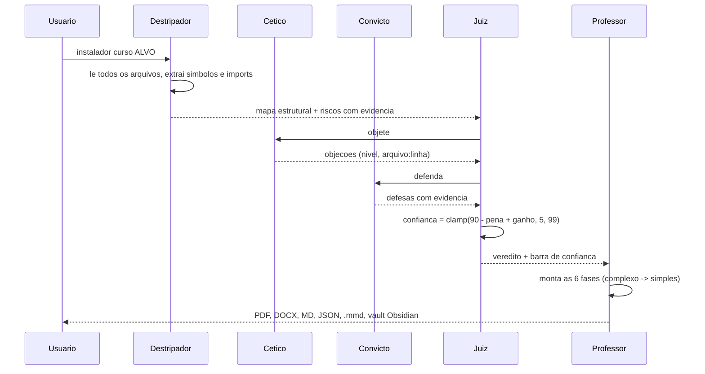

# AGENTES — o tribunal e o método

Seis agentes. Cinco trabalham sobre o material; o sexto trabalha sobre você.
As duas regras da casa:

1. **Material nenhum vira ensino antes de passar pelo tribunal.**
2. **Argumento nenhum vale sem evidência** — se não tem `arquivo:linha`, não entra.



## Roster

| Agente | Módulo | Papel |
|---|---|---|
| Destripador | `destripador.py` | transforma qualquer coisa em mapa estrutural |
| Professor | `professor.py` | transforma mapa + veredito em 6 fases didáticas |
| Cético | `debaters.py` | desafia cada explicação com buraco, exceção e premissa oculta |
| Convicto | `debaters.py` | sustenta a versão mais forte da explicação, com evidência |
| Juiz | `debaters.py` | pontua, mede a confiança e redige o veredito |
| Sócrates | `socrates.py` | só pergunta; recalibra a cada resposta sua |

## Destripador

Único agente com permissão para ler arquivos. O que entrega é o contrato de todos os
outros: `nome`, `raiz`, `arquivos` (caminho, linhas, linguagem, papel inferido),
`grafo` (arestas reais extraídas dos imports), `riscos` (cada um com `nivel`,
`titulo`, `arquivo`, `linha`, `trecho`), `estruturais`, `fortes`, `cobertura_doc`,
`leitura_sugerida` e `resumo`. Os demais agentes **nunca olham o disco**:
discutem o mapa. Assim o tribunal é reproduzível — mesmo mapa, mesmo veredito.

## Cético

Três fontes de objeção, nessa ordem:

1. **Riscos detectados** — padrões de intenção: credencial em claro, chave reconhecível
   (`ghp_`, `AKIA`, `sk-`), `eval/exec`, SQL por concatenação, `shell=True`,
   `innerHTML`, `except` genérico, CORS aberto, `DEBUG=True`, `http://` para fora,
   TODO/FIXME.
2. **Riscos estruturais** — arquivo acima de 600 linhas, função acima de 60 linhas.
3. **Perguntas universais** — entrada vazia/gigante, dois processos ao mesmo tempo,
   onde termina a confiança no dado de fora, o caminho mais longo até o código.

Cada objeção nasce com endereço: `{nivel, evidencia: "arquivo:linha", texto}`.
Se faltarem objeções factuais (menos de 3), ele pede ao modelo de IA — se houver —
até cinco objeções novas, marcadas `modelo`. Máximo de dez no veredito.

## Convicto

Defende com o que existe de melhor no mapa: teste, pipeline de CI, Dockerfile,
LICENSE, README, docstrings (com percentual), type hints, superfície pequena.
Toda defesa carrega `evidencia`. Se o projeto não tiver defesa nenhuma, a última
âncora é o próprio mapa: “cada afirmação deste curso aponta para o código” —
evidência `mapa.json`.

## Juiz

Matemática fechada, sem mistério:

| Nível | Peso |
|---|---|
| crítico | 8 |
| alto | 5 |
| médio | 2 |
| baixo | 1 |

```
pena      = soma dos pesos das objeções
ganho     = min(10, 2 × número de defesas)
confiança = max(5, min(99, 90 − pena + ganho))

>= 80  -> "material sólido — explicar como está, citando as ressalvas"
>= 55  -> "aceito com ressalvas — ensinar primeiro as objeções marcadas, depois o mérito"
<  55  -> "questionado — o aluno precisa ver onde quebra ANTES de aprender o caminho feliz"
```

A barra é `confiança/5` blocos cheios em 20: 59/100 arredonda para doze cheios
(`████████████░░░░░░░░`). O veredito volta junto com a pontuação completa
(`pena`, `ganho`) — transparência total no `mapa.json`, no vault e na capa.

## Sócrates

Mede nuance, não conteúdo. De cada resposta sua extrai três sinais:

- **jargão técnico** (função, variável, loop, api, endpoint, banco, …) → sobe o nível;
- **hesitação** (acho, tipo, talvez, mais ou menos, confuso, …) → desce;
- **estrutura e extensão** da resposta → ajusta.

Nível 1 (analogia e pergunta de chão) a 5 (pergunta de entrevistador sênior).
Há um banco de perguntas indexado por `(fase, nível)`; cada sua resposta recalibra
a próxima. O invariável: **ele nunca responde**. Toda pergunta termina mandando
você para um lugar do código — `mostre onde`, `traça em voz alta`, `o que acontece
se chegar vazio?`.

`instalador chat [ALVO] [--fase N] [--rodadas N]` inicia a sessão; `--mapa mapa.json`
reaproveita um scan anterior.

## Como consumir o veredito

- **Humano:** leia a Fase 5 e decida: se está `questionado`, conserte as objeções
  críticas antes de mostrar o código a alguém.
- **Agente:** `curso.md` diz exatamente o que fazer — leia-o, abra `mapa.json`
  quando precisar de evidência, responda às perguntas da Fase 6.

## Estender (adicionar um agente novo)

1. Crie o módulo em `instalador_core/` com atributos `nome` e `papel` e **um**
   método público que receba o mapa (não o disco).
2. Encaixe-o no ritual em `professor.py` (produção) ou `relatorios.py` (publicação).
3. Publique a saída dele: uma nota no vault Obsidian e uma seção no `curso.md`.
4. Escreva o teste primeiro: agente sem teste é opinião, e opinião não entra na casa.
